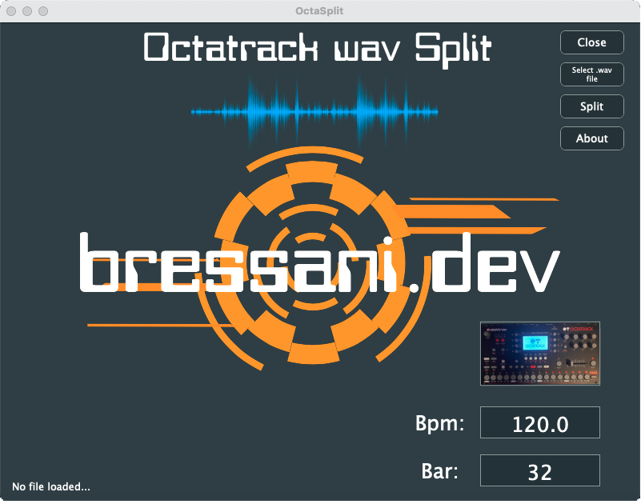

# OctaSplit par bressani.dev

Bienvenue dans OctaSplit, une application multiplateforme développée en C++.

## À propos
OctaSplit est un outil pratique destiné aux producteurs de musique. Il permet de prendre un fichier généré par un logiciel de musique assistée par ordinateur, tel que Cubase, Ableton Live, Fruity Loops, Logic ou Bitwig, et de le découper en petits morceaux prêts à être utilisés dans l'Octatrack d'Elektron.

## Caractéristiques
- **Compatible multiplateforme** : Fonctionne sur tous les systèmes d'exploitation courants. Testé sur Mac OS 13 Ventura (intel), Windows 10 et Ubuntu 22.04 Gnome.
- **Découpage des fichiers audio** : Transformez vos fichiers audio en fragments prêts à être utilisés dans l'Octatrack.

## Fonctionnement
Avec OctaSplit, manipuler vos fichiers audio n'a jamais été aussi simple. Ouvrez un fichier WAV, puis cliquez sur le bouton « Split ». Instantanément, le programme divise votre fichier en plusieurs segments, créant des fichiers tels que nomfichier_00.wav, nomfichier_01.wav, etc. Un outil pratique et efficace pour ceux qui veulent des boucles sur un sampler tel que l'octatrack d'Elektron.



## Licence
OctaSplit est publié sous la licence open source GNU General Public License v3.0. Vous êtes libre de modifier, distribuer et utiliser le logiciel en accord avec les termes de cette licence.

Pour plus de détails, veuillez consulter le fichier `LICENSE` inclus dans le dépôt.

L'image de fond a été utilisé de GarryKillian on Freepik. Une partie du design du logo a été crée à partir d'une modification de l'image de onfocus sur Freepik.

## Compilation

### MacOs / Windows / Linux
Nécessite cmake pour compiler.

### MacOs
Compiler avec cmake. Vous devrez peut-être ajouter les bibliothèques portaudio, sndfile et juce.

### Windows
Nécessite la bibliothèque portaudio. (https://github.com/PortAudio/portaudio)

```
cd build
cmake ..
```

Ouvrez en administrateur la solution Visual Studio et compilez la bibliothèque. Ensuite, modifiez le CMakeFile.txt de ce projet avec le chemin approprié, et compilez ce projet (OctaSplit) avec cmake et Visual Studio.

### Ubuntu

Nécessite clang.

```
sudo apt-get install libfreetype6-dev libgtk-3-dev libwebkit2gtk-4.0-dev
```

Sur mon bureau Ubuntu 22.04 Gnome, j'ai un problème avec la fonction de glisser-déposer qui ne fonctionne pas. Pour charger un fichier .wav à découper, utilisez le bouton prévu à cet effet.

## Contact
Pour toute question ou suggestion, n'hésitez pas à me contacter sur [bressani.dev](http://bressani.dev).
